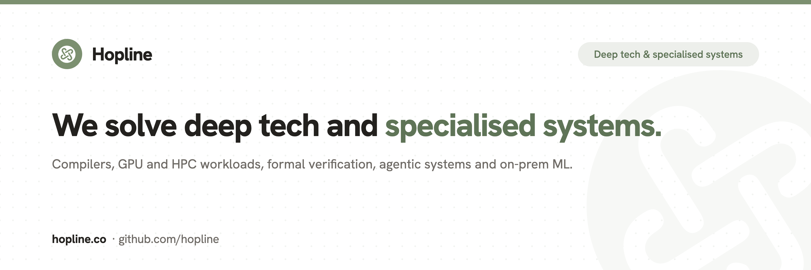

  
  <h1>Hopline</h1>
  
<strong>We turn vision and ideas into products.</strong> 
  A product studio and open workshop. We build with you, not at you.

  

    <a href="https://hopline.co">hopline.co</a> ·
    <a href="mailto:contact@hopline.co">contact@hopline.co</a>
  

---

We are a small studio that designs and ships real products: apps, mobile, AI/ML,
design systems, platforms and the web. You stay in the repo and the standups the
whole way, and where it makes sense we open-source the reusable parts so the next
team starts further ahead.

### What we do

- **Apps & mobile**: native-feeling products for web, iOS and Android.
- **AI & ML**: practical LLM features, RAG and custom models wired into real products.
- **Design systems**: the tokens, components and docs that keep teams fast and consistent.
- **Platforms & tooling**: the infrastructure that quietly makes everything else work.
- **Product strategy**: from a fuzzy vision to a scoped, sequenced, de-risked plan.
- **Web & marketing**: fast, accessible, search-friendly sites.

### How we work

Discover → shape → build → ship → open. Designers and engineers in the same room,
shipping in short loops, transparent by default. It is your product, not a black box.

### Find us

Start at **[hopline.co](https://hopline.co)**, browse our work and open source there,
or say hello at **[contact@hopline.co](mailto:contact@hopline.co)**.

Brand seed: Sage <code>#7C9070</code>
